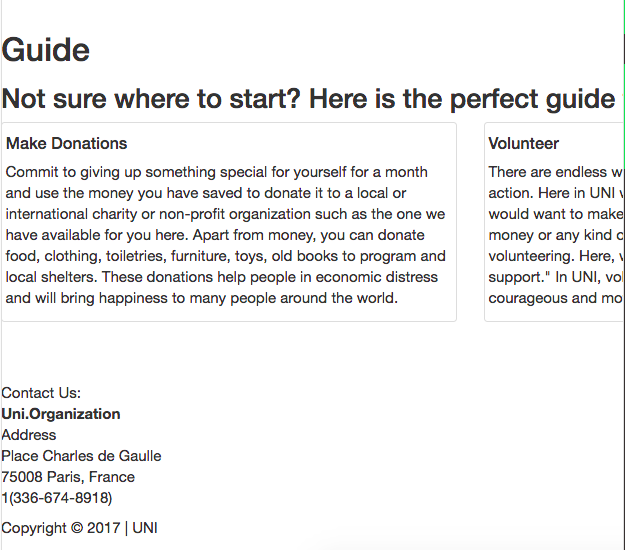
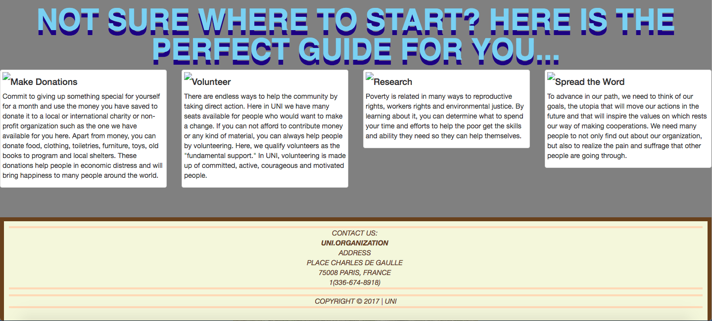

# Entry 7:
## Project Development (Week 1) 

Photo Credit: https://medium.com/@lhyx/10-gifs-that-perfectly-describe-my-aiesec-volunteer-exchange-aca92d9f60ea

## Plan to the Rescue!
Before starting my project I already knew I wanted to do a website, but I did not know what it was going to be about. I later
on realized that I wanted to start from a base and not completely from scratch. So, I started off with an old website I made and
deleted all the css code and changed it for the new SASS code.

## No CSS or SASS:

## SASS:

## What am I doing with all this code?
- Working with my partners at first made me a little confused because I realized that we were using regular CSS code. CSS and SASS looks very similar but at the same 
time they have their own uniqueness. 
- We started off with basic SASS code but we want to keep improving and demonstrate what we have learned throughout the past weeks.

## What are my Views for the Website ?
- I basically want it to look very appealing and professional.
- Keep improving with SASS and see what it can truly do to a website.
- Here is the link to the website: https://preview.c9users.io/biannak6288/independent-study/final-project/index.html?_c9_id=livepreview0&_c9_host=https://ide.c9.io
    - It is still not finished but we are working on making the fonts and formatting more organized.
## Next week Goals
* Add more SASS to my website and make it more appealing to the eye.
* Try to start making my own portfolio 

### <strong>Takeaways</strong>
1) Do not stress yourself out. Not everything will turn out the way you expect it to. Go at your pace but also show some improvement.
2) **Ask your classmates for help.** We are all working on a project and some may be working on the same topic as you. Share ideas, share your obstacles, learn from one another.
3) Start Googling. Never be afraid to look up specific things you need in order to move on with your project or feel like you have not gone through it thoroughly. 

