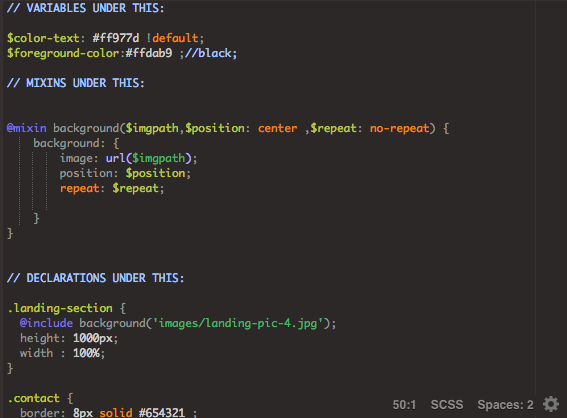
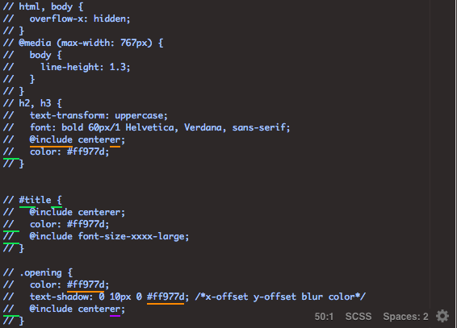

# Entry 8:
## Slowly but Surely (Week 2) 

Photo Credit: https://www.wikihow.com/Animate-in-FireAlpaca

## Project Crisis
While working on the project I realized that my partners and I were working on individual things, which is good, but we did not realize that our code began to look very disorganized.
Every time something was added there was an error and we did not know from who it came from nor how to fix it. This is when My partners and I realized that we needed a new technique to get the project finished faster.

## Trying to be Organized
Now that we have realized that our code cannot be placed in random places we decided to use comments.
In our code we made three different sections of variables, mixins and declarations.

 
- With these sections my partners and I can all be able to see what new things were being made and what variables or mixins were already made.
- Although it may look more organized now, we decided to start over since our website was not how we wanted it to look.

## Trying to Speed Up the Process

- Starting fresh may seem terrifying at first but we are all picking up the pace at this point. We decided to comment our old code out and try to see how we can make them more efficient and actually make them work.

- Now that we are more organized things will move quickly and new amazing things will be made. (We hope so)

## Next week Goals
* Add more SASS to my website and organize pictures to make it look more appealing.
* Try to change the content of the website to make it more beneficial for me.  

### <strong>Takeaways</strong>
1) **Ask your classmates for help.** We are all working on a project and some may be working on the same topic as you. Go on slack and ask for help.
2) Look back at your notes, you may have written down something that will help you with what you are stuck on now. 
3) Start Googling. Look up specific things you need in order to move on with your project.  

